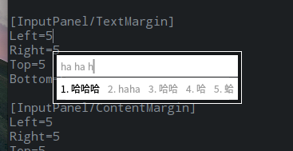

# simple

A simple theme for fcitx5

Original author: [叫小兽](https://pinyin.sogou.com/skins/achome/index/5355095f550704557517414b520b0c/)

 

## Install

```
git clone https://github.com/iovxw/fcitx5-simple-theme.git ~/.local/share/fcitx5/themes/simple
```

Add the following to your `~/.config/fcitx5/conf/classicui.conf`

```ini
# True, if you want a vertical candidate list
Vertical Candidate List=False
Theme=simple
```

## License

This is free and unencumbered software released into the public domain.

Anyone is free to copy, modify, publish, use, compile, sell, or distribute this software, either in source code form or as a compiled binary, for any purpose, commercial or non-commercial, and by any means.
